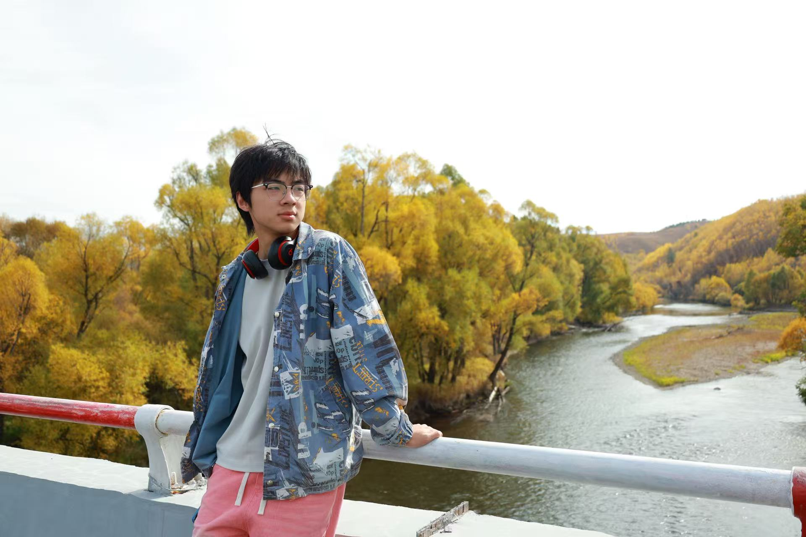
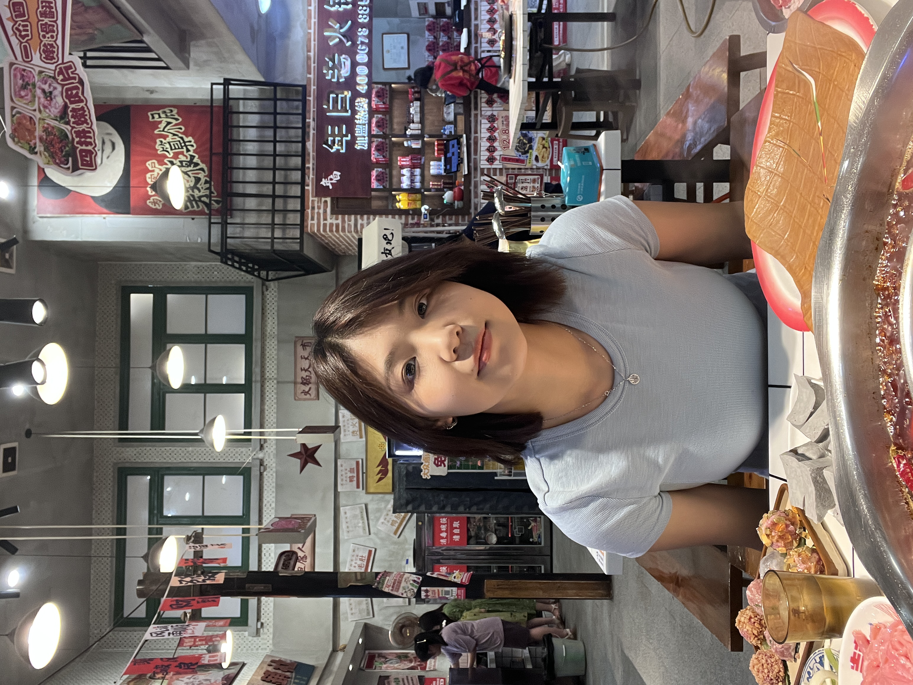
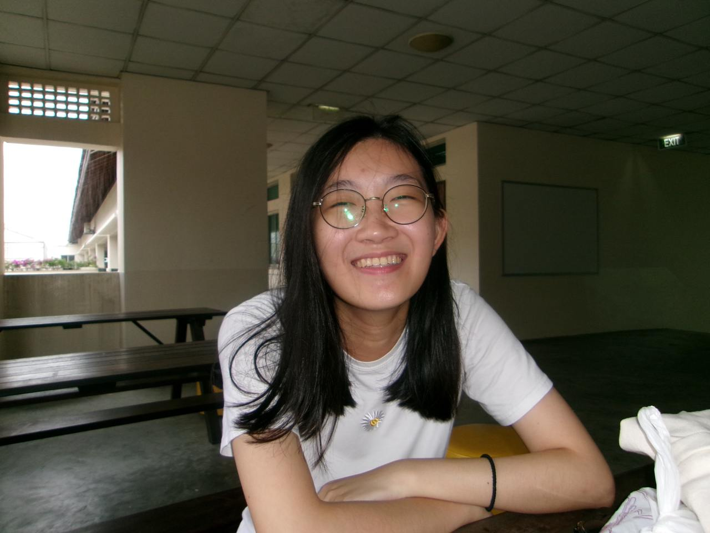

# About Us

We are a team based in the [School of Computing, National University of Singapore](http://www.comp.nus.edu.sg).

You can reach us at the email `seer[at]comp.nus.edu.sg`

## Project team

### ChuckYang123

[[homepage](https://chuckyang123.github.io/)]
[[github](https://github.com/chuckyang123)]
[[portfolio](team/chuckyang123.md)]

* Role: Deliverables and deadlines & Scheduling and tracking
* Responsibilities: Data

### Junrong

[[github](http://github.com/Junronggg)]
[[portfolio](https://junronggg.github.io/)]

* Role: UI/UX design & deadlines tracking
* Responsibilities: UI/UX and Data

### Jiayi 

[[github](http://github.com/broccoli0616)] [[portfolio](https://broccoli0616.github.io/Zhang-Jiayi-page/)]

* Role: Developer
* Responsibilities: Data

### Letian

[[homepage](https://fisherskyi.github.io/)]
[[github](https://github.com/FisherSkyi)]
[[portfolio](team/johndoe.md)]

* Role: Developer
* Responsibilities: Testing + Integration

### Yu Xin

[[github](http://github.com/watermelonisred)]
[[portfolio](team/johndoe.md)]

* Role: Developer
* Responsibilities: Documentation
