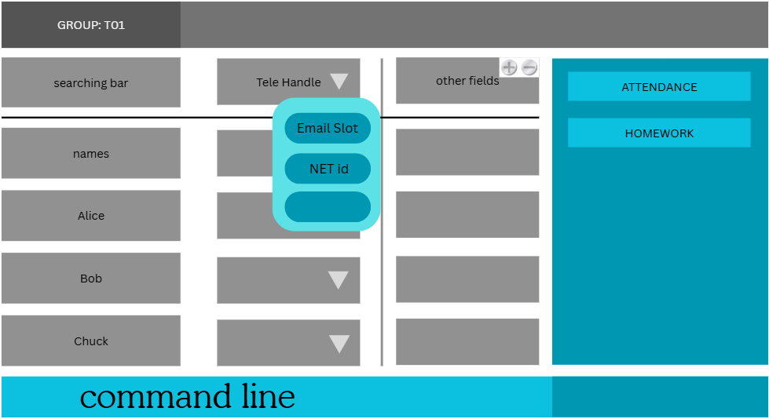
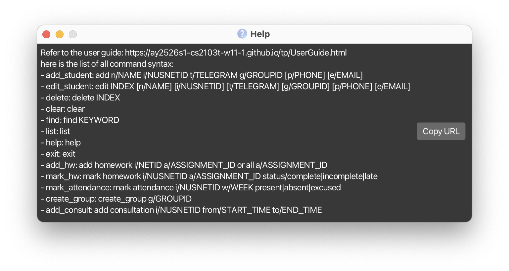

# AB-3 User Guide

AddressBook Level 3 (AB3) is a **desktop app for managing contacts, optimized for use via a  Line Interface** (CLI) while still having the benefits of a Graphical User Interface (GUI). If you can type fast, AB3 can get your contact management tasks done faster than traditional GUI apps.

<!-- * Table of Contents -->
<page-nav-print />

--------------------------------------------------------------------------------------------------------------------

## Quick start

1. Ensure you have Java `17` or above installed in your Computer. 
   **Mac users:** Ensure you have the precise JDK version prescribed [here](https://se-education.org/guides/tutorials/javaInstallationMac.html).

1. Download the latest `.jar` file from [here](https://github.com/se-edu/addressbook-level3/releases).

1. Copy the file to the folder you want to use as the _home folder_ for your AddressBook.

1. Open a command terminal, using command `cd` + the path to get into the folder you put the jar file in, and use the `java -jar SoCTAssist.jar` command to run the application. 
   A GUI similar to the below should appear in a few seconds. Note how the app contains some sample data. 
   

1. Type the command in the command box and press Enter to execute it. e.g. typing **`help`** and pressing Enter will open the help window. 
   Some example commands you can try:

   * `list` : Lists all contacts.

   * `add_student n/John Doe  i/E1234567 t/@john g/T01 p/98765432 e/johnd@@u.nus.edu` : Adds a contact named `John Doe` to the Address Book.

   * `delete 3` : Deletes the 3rd contact shown in the current list.

   * `clear` : Deletes all contacts.

   * `exit` : Exits the app.

1. Refer to the [Features](#features) below for details of each command.

--------------------------------------------------------------------------------------------------------------------

## Features

<box type="info" seamless>

**Notes about the command format:** 

* Words in `UPPER_CASE` are the parameters to be supplied by the user. 
  e.g. in `add_student n/NAME`, `NAME` is a parameter which can be used as `add_student n/John Doe`.

* Items in square brackets are optional. 
  e.g `n/NAME [p/PHONE]` can be used as `n/John Doe p/87415612` or as `n/John Doe`.

* Parameters can be in any order. 
  e.g. if the command specifies `n/NAME p/PHONE_NUMBER`, `p/PHONE_NUMBER n/NAME` is also acceptable.

* Extraneous parameters for commands that do not take in parameters (such as `help`, `list`, `exit` and `clear`) will be ignored. 
  e.g. if the command specifies `help 123`, it will be interpreted as `help`.

* If you are using a PDF version of this document, be careful when copying and pasting commands that span multiple lines as space characters surrounding line-breaks may be omitted when copied over to the application.
</box>

### Viewing help : `help`

Shows a message explaining how to access the help page.

Format: `help`

### Adding a person: `add_student`

Adds a person to the address book.

Format: `add_student n/NAME i/NUSNETID t/TELEGRAM g/GROUPID  [p/PHONE_NUMBER] [e/EMAIL]`

<box type="tip" seamless>

**Tip:** Phone and email are optional. You can omit either or both when adding a person.
A person can have any number of tags (including 0).
</box>

Examples:
* `add_student n/John Doe i/E1234567 t/@handle g/T01` (no phone or email)
* `add_student n/John Doe i/E1234567 t/@handle g/T01  p/98765432 e/johnd@u.nus.edu`
* `add_student n/Betsy Crow i/E1234562 p/1234567 t/@betsy g/T02  e/betsycrowe@u.nus.edu`

### Listing all persons : `list`

Shows a list of all persons in the ADDRESS book.

Format: `list`

### Editing a person : `edit_student`

Edits an existing person in the ADDRESS book.

Format: `edit INDEX [n/NAME] [i/NUSNETID]  [t/TELEGRAM] [g/GROUPID] [p/PHONE] [e/EMAIL]`

* Edits the person at the specified `INDEX`. The index refers to the index number shown in the displayed person list. The index **must be a positive integer** 1, 2, 3, …​
* At least one of the optional fields must be provided.
* Existing values will be updated to the input values.
* Phone and email are optional. You can remove them by omitting these fields in your edit command.

Examples:
*  `edit_student 1 p/91234567 e/johndoe@u.nus.edu` Edits the phone number and email ADDRESS of the 1st person to be `91234567` and `johndoe@u.nus.edu` respectively.
*  `edit_student 2 n/Betsy Crower` Edits the name of the 2nd person to be `Betsy Crower`.
*  `edit_student 3` Removes phone and email from the 3rd person (if present).

### Locating persons by name: `find`

Finds persons whose names contain any of the given keywords.

Format: `find KEYWORD [MORE_KEYWORDS]`

* The search is case-insensitive. e.g `hans` will match `Hans`
* The order of the keywords does not matter. e.g. `Hans Bo` will match `Bo Hans`
* Only the name is searched.
* Only full words will be matched e.g. `Han` will not match `Hans`
* Persons matching at least one keyword will be returned (i.e. `OR` search).
  e.g. `Hans Bo` will return `Hans Gruber`, `Bo Yang`

Examples:
* `find John` returns `john` and `John Doe`
* `find alex david` returns `Alex Yeoh`, `David Li` 
  

### Deleting a person : `delete`

Deletes the specified person from the ADDRESS book.

Format: `delete INDEX`

* Deletes the person at the specified `INDEX`.
* The index refers to the index number shown in the displayed person list.
* The index **must be a positive integer** 1, 2, 3, …​

Examples:
* `list` followed by `delete 2` deletes the 2nd person in the ADDRESS book.
* `find Betsy` followed by `delete 1` deletes the 1st person in the results of the `find` command.

### Adding homework : `add_hw`

Adds a homework assignment for the specified student or for all students.

Format: `add_hw i/NUSNETID (use 'all' for all students) a/ASSIGNMENT`

* Adds the homework with the given assignment number for the specified student.
* If `all` is used, the homework is added for all students.
* The NUSNET ID **must be valid** and the assignment identifier **must be specified**.

Examples:
* `add_hw i/E1234567 a/1` adds assignment 1 for the student with NUSNET ID `E1234567`.
* `add_hw i/all a/2` adds assignment 2 for all students.

---

### Marking homework : `mark_hw`

Marks the homework status for the specified student.

Format: `mark_hw i/NUSNETID a/ASSIGNMENT status/STATUS`

* Marks the specified assignment for the given student.
* The `STATUS` can be one of the following: `complete`, `incomplete`, or `late`.
* The NUSNET ID and assignment number **must be valid**.

Examples:
* `mark_hw i/E1234567 a/1 status/complete` marks assignment 1 as complete for student `E1234567`.
* `mark_hw i/E2345678 a/2 status/late` marks assignment 2 as late for student `E2345678`.

---

### Deleting homework : `delete_hw`

Deletes the homework for the specified student or for all students.

Format: `delete_hw i/NUSNETID (use 'all' for all students) a/ASSIGNMENT`

* Deletes the homework with the given assignment number for the specified student.
* If `all` is used, the homework is deleted for all students.
* The NUSNET ID **must be valid** and the assignment identifier **must be specified**.

Examples:
* `delete_hw i/E1234567 a/1` deletes assignment 1 for the student with NUSNET ID `E1234567`.
* `delete_hw i/all a/2` deletes assignment 2 for all students.

---

### Marking attendance : `mark_attendance`

Marks the attendance status for the specified student and week.

Format: `mark_attendance i/NUSNETID week/WEEK status/STATUS`

* Marks attendance for the given student and week.
* The `STATUS` can be one of the following: `present`, `absent`, or `excused`.
* The NUSNET ID and week number **must be valid**.

Examples:
* `mark_attendance i/E1234567 week/3 status/present` marks student `E1234567` as present for week 3.
* `mark_attendance i/E2345678 week/5 status/absent` marks student `E2345678` as absent for week 5.

---

### Adding a consultation : `add_consult`

Adds a consultation session for the specified student.

Format: `add_consult i/NUSNETID from/DATE_TIME to/DATE_TIME`

* Adds a consultation slot for the specified student.
* Both start (`from`) and end (`to`) times **must be in `YYYYMMDD HHmm` format**.
* The start time must be **earlier** than the end time**.

Examples:
* `add_consult i/E1234567 from/20240915 14:00 to/20240915 1500` adds a consultation for student `E1234567` from 2–3 PM on 15 Sep 2024.
* `add_consult i/E2345678 from/20240920 1000 to/20240920 1100` adds a consultation from 10–11 AM for student `E2345678`.

---

### Creating a group : `create_group`

Creates a new tutorial group.

Format: `create_group g/GROUPID`

* Creates a new group with the specified group ID.
* The group ID **must be unique**.
* Group IDs typically follow the format `TXX` or `BXX`, where `XX` is a number.

Examples:
* `create_group g/T03` creates a new group with ID `T03`.
* `create_group g/T05` creates a new group with ID `T05`.

### Clearing all entries : `clear`

Clears all entries from the ADDRESS book.

Format: `clear`

### Exiting the program : `exit`

Exits the program.

Format: `exit`

### Saving the data

AddressBook data are saved in the hard disk automatically after any command that changes the data. There is no need to save manually.

### Editing the data file

AddressBook data are saved automatically as a JSON file `[JAR file location]/data/addressbook.json`. Advanced users are welcome to update data directly by editing that data file.

<box type="warning" seamless>

**Caution:**
If your changes to the data file makes its format invalid, AddressBook will discard all data and start with an empty data file at the next run.  Hence, it is recommended to take a backup of the file before editing it. 
Furthermore, certain edits can cause the AddressBook to behave in unexpected ways (e.g., if a value entered is outside the acceptable range). Therefore, edit the data file only if you are confident that you can update it correctly.
</box>

--------------------------------------------------------------------------------------------------------------------

## FAQ

**Q**: How do I transfer my data to another Computer? 
**A**: Install the app in the other computer and overwrite the empty data file it creates with the file that contains the data of your previous AddressBook home folder.

--------------------------------------------------------------------------------------------------------------------

## Known issues

1. **When using multiple screens**, if you move the application to a secondary screen, and later switch to using only the primary screen, the GUI will open off-screen. The remedy is to delete the `preferences.json` file created by the application before running the application again.
2. **If you minimize the Help Window** and then run the `help` command (or use the `Help` menu, or the keyboard shortcut `F1`) again, the original Help Window will remain minimized, and no new Help Window will appear. The remedy is to manually restore the minimized Help Window.

--------------------------------------------------------------------------------------------------------------------

## Command summary

Action     | Format, Examples
-----------|---------------------------------------------------------------------------------------------------------------------------------------------------------------------
**AddStudent**    | `add_student n/NAME  i/NUSNETID t/TELEGRAM s/SLOT [p/PHONE_NUMBER] [e/EMAIL] `   e.g., `add n/James Ho  i/E1234567 tg/@jame s/T02 [p/22224444] [e/jamesho@u.nus.edu]`
**Clear**  | `clear`
**Delete** | `delete INDEX`  e.g., `delete 3`
**EditStudent**   | `edit_student INDEX [n/NAME] [i/NUSNETID] [t/TELEGRAM] [p/PHONE_NUMBER] [e/EMAIL]  [s/SLOT]`  e.g.,`edit 2 n/James Lee e/jameslee@u.nus.edu`
**AddHomework**  | `add_hw i/NUSNETID (all for all students) a/ASSIGNMENT`   e.g., `add_hw i/E1234567 a/1`
**MarkHomework**  | `mark_hw i/NUSNETID  a/ASSIGNMENT status/STATUS(complete incomplete late)`   e.g., `mark_hw i/E1234567 a/1 complete`
**MarkAttendance**  | `mark_attendance i/NUSNETID week/WEEK status/STATUS(present absent excused)`   e.g., `mark_attendance i/E1234567 week/3 status/present`
**AddConsultation**  | `add_consult i/NUSNETID from/DATE_TIME to/DATE_TIME`   e.g., `add_consult i/E1234567 from/2024-09-15 14:00 to/2024-09-15 15:00`
**CreateGroup**  | `create_group g/GROUPID`   e.g., `create_group g/T03`
**Find**   | `find KEYWORD [MORE_KEYWORDS]`  e.g., `find James Jake`
**List**   | `list`
**Help**   | `help`
**Exit**   | `exit`

## Glossary
* **NETS id**: A unique identifier assigned to each student by the National University of Singapore (NUS) 
during matriculation. It is used for logging into various NUS systems.
* **NUS email**: The official email address assigned to each student by NUS, typically 
in the format `<NETS id>@u.nus.edu`.
* **CLI**: Command Line Interface. A text-based interface used to interact with software applications 
by typing commands.
* **Week**: There are 13 weeks in each academic semester in NUS, and tutorial starts in Week 3.
* **Assessment/Homework**: Work need to be done and submitted by mentees, graded by tutors.
* **Consultation**: A session where mentees can seek help from tutors regarding their academic work or other 
related matters.
* **Mentor (TA)/Mentee**: A mentor (TA) is a senior student who provides guidance and support to a junior student, 
known as a mentee.
* **OOP**: Object-Oriented Programming. A programming paradigm that uses "objects" to represent data and methods 
to manipulate that data.
* **GUI**: Graphical User Interface. A visual interface that allows users to interact with software applications 
using graphical elements such as windows, icons, and buttons.
* **JSON**: JavaScript Object Notation. A lightweight data interchange format that is easy for humans to read and write
, and easy for machines to parse and generate.
* **JDK**: Java Development Kit. A software development environment used for developing Java applications.
* **Jar file**: A Java ARchive file. A package file format used to aggregate many Java class files and associated 
metadata and resources into one file for distribution.
* **KLoC**: Kilo Lines of Code. A measure of software size, representing 1,000 lines of code.
* **CD**: Command Directory. The current directory in which the command terminal is operating.
